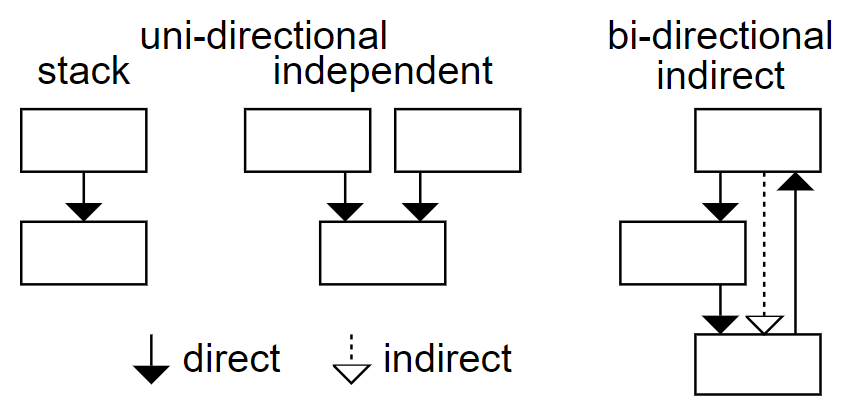

This case study investigates and demonstrates the capabilities of [Eunice](https://devsnicket.com/eunice), by using Eunice on the JavaScript library [React](https://reactjs.org).

> Eunice helps improve software architecture by analyzing, measuring, exploring and defining; structure and dependencies.
> 
> Eunice is based on the premise that software structure and modularity improve when dependencies are unidirectional. Eunice's approach isn't limited to direct dependencies, but includes indirect dependencies as well.
>
>With Eunice you define an intended structure/architecture, it shows you dependencies that don't match, and you can further refine the definition or update your code to match.

I've based the case study on the [0f3838a](https://github.com/DevSnicket/react/commit/0f3838a01b0fda0ac5fd054c6be13166697a113c) commit in the React repository. I've created a fork to make it easier if you want to follow along:

```bash
git clone https://github.com/DevSnicket/react.git react-eunice
cd react-eunice
```

Eunice can be downloaded from NPM and run without installing using NPX:

```bash
npx eunice
```

You will be prompted to accept a EULA. Eunice is free to use on open source projects, and its free to use for education and training. Therefore contributions to React and following along with this case study both qualify. There is also an evaluation period to try Eunice out on closed source commercial software.

# configuration

Running Eunice on React without any parameters will raise the following error:

```bash
Error: Analysis of file "packages\create-subscription\index.js" raised the following error.

  Unexpected token, expected ";" (14:5)
```

This error is raised because React uses [Flow](https://flow.org/) syntax in its JavaScript. Eunice uses [Babel](https://babeljs.io) to parse JavaScript and a Flow plug-in can be enabled with the option [babel-parser-plugins](https://devsnicket.com/eunice/javascript/options/#babel-parser-plugins). Some of the Babel parser plug-ins are enabled by default and so will also need to be specified so they aren't disabled when enabling Flow:

```bash
npx eunice \
--babel-parser-plugins=classPrivateProperties \
--babel-parser-plugins=classProperties \
--babel-parser-plugins=dynamicImport \
--babel-parser-plugins=flow \
--babel-parser-plugins=jsx
```

Running Eunice with the Babel plug-ins specified above will raise a further error:

```bash
Error: Analysis of file "scripts\prettier\index.js" raised the following error.

  'return' outside of function (32:2)
```

Eunice parses with a [Babel source type](https://babeljs.io/docs/en/options#sourcetype) of module, but the file specified in the error is a script. The option [ignore-path-pattern](https://devsnicket.com/eunice/javascript/options/#ignore-paths) can be used to ignore the "script" directory. I've also included the default ignores and one for babel.config.js. The option is specified with double quotes as the pipe character is used in the regular expression.

```bash
npx eunice \
--ignore-path-pattern="(^(\.|babel.config.js|scripts)|node_modules)" \
--babel-parser-plugins=classPrivateProperties \
--babel-parser-plugins=classProperties \
--babel-parser-plugins=dynamicImport \
--babel-parser-plugins=flow \
--babel-parser-plugins=jsx
```

Analysis with the options above should complete successfully and output a eunice.html file. Opening the file in a browser should show the following:


On the left a text editor is displaying 78,696 lines of [YAML](https://devsnicket.com/eunice/advanced/yaml) produced by Eunice's analysis and [processing](https://devsnicket.com/eunice/javascript/processing) of React.

On the right is a graphical representation of all the [dependencies](https://devsnicket.com/eunice/dependencies) and the root directories (fixtures and packages) in React. The green and red count arrows represent the dependencies, categorized as follows:


Ideally all dependencies should be matching, shown as counts only in the green down arrows and no red arrows. This would be a demonstration (as far as Eunice JavaScript analysis is currently capable) that dependencies were all unidirectional, including indirect dependencies.



An example of software that’s close to having only unidirectional dependencies is Eunice itself, you can see this by looking at its [dogfooding](https://en.wikipedia.org/wiki/Eating_your_own_dog_food):


You can interact with Eunice’s dogfooding [here](https://devsnicket.com/eunice/dogfooding).

# structure

So far, no [structure](https://devsnicket.com/eunice/structure) has been defined in any stacks, so we see items listed horizontally. Eunice also infers stacks, in JavaScript this includes the order within a file. In the browser, if for example, dangerfile is selected, the contents of the file dangerfile.js are displayed:


The items in the lowest level are all the module import and CommonJS require calls that Eunice automatically moves below the file content. The other two levels have dependencies that don’t match and so have counts shown in red up arrows. By default Eunice expects code within a file to be ordered high level first with more detail as you move down. The option [is-file-content-reversed](https://devsnicket.com/eunice/javascript/options/#reverse-files) can reverse this:

```bash
npx eunice \
--is-file-content-reversed=true \
--ignore-path-pattern="(^(\.|babel.config.js|scripts)|node_modules)" \
--babel-parser-plugins=classPrivateProperties \
--babel-parser-plugins=classProperties \
--babel-parser-plugins=dynamicImport \
--babel-parser-plugins=flow \
--babel-parser-plugins=jsx
```

The file will then show with all matching green dependency counts (after reloading the browser):


Looking at the root directory, a lot more of Reacts dependencies are now shown as matching in green:


There are still 1,592 dependencies, shown in a red horizontal arrow, that are between items that don’t have a structure defined yet.

There are often conventions in codebases and in React there are many instances of directories that are always either above or below all the other directories. One example is that the __tests__ directory depends on what it tests. Another example is that the rest of the code depends on the shared directory. This is represented below in YAML, with “existing” being used as placeholder for items not specified:

```yaml
- [ forks, __tests__ ]
- - existing
- - src
- - shared
```

The YAML above can be saved into a file (.eunice-stack-modify.yaml) and that file can be specified with the [modify-stacks-file](https://devsnicket.com/eunice/javascript/options/#modify-stacks) option so that Eunice modifies all stacks with the following option:

```bash
npx eunice \
--modify-stacks-file=.eunice-stack-modify.yaml \
--is-file-content-reversed=true \
--ignore-path-pattern="(^(\.|babel.config.js|scripts)|node_modules)" \
--babel-parser-plugins=classPrivateProperties \
--babel-parser-plugins=classProperties \
--babel-parser-plugins=dynamicImport \
--babel-parser-plugins=flow \
--babel-parser-plugins=jsx
```

You can see examples of what effect this has in React by looking inside packages/react-interactions/events and its sub-directory src/dom:


This reduces the count of mismatching dependencies in the red horizontal arrow by over a third, from 1,592 to 903:


YAML stack files of structure like the one above can also be created for individual directories. Eunice automatically does this when files named .eunice-stack.yaml are saved with the code. I’ve worked through React and created 36 stack files. If you want to view the files I’ve created a branch called with-stacks was created and the stack files added in commit [4dffcae](https://github.com/DevSnicket/react/commit/4dffcae81fdcfa8d288bd350d74517bd6d7d4a26).

The stacks have removed all the remaining 903 unstructured dependencies; however, I wasn’t able to define structures that would make all dependencies go in the same direction. These mismatching dependencies are shown in the red up arrow count of 815 below:


You can see more specific dependency count arrows and the structure I chose, by looking inside the packages sub-directory:


The packages directory has enough items and levels that it can be hard to remember what all the dependency relationships are. This can be improved by grouping items that share concepts and dependency relationships. The six sub-directories highlighted below all relate to devtools and could be grouped:


To investigate how this might look the Eunice stack file in the packages directory can be modified. I've added a new item named react-devtools-group and moved the six related items inside it:

```
- - existing
- - id: react-devtools-group
    dependencyPermeable: true
    items:
      - - react-devtools
      - - react-devtools-shell
      - - react-devtools-core
      - - react-devtools-inline
      - - react-devtools-extensions
      - - react-devtools-shared
- [ react-art, react-interactions, react-refresh ]
- - react-test-renderer
- [ react-dom, react-native-renderer, react-noop-renderer ]
- [ legacy-events, react-reconciler ]
- [ create-subscription, jest-mock-scheduler, jest-react, react-cache, react-is, react-stream, use-subscription ]
- [ babel-plugin-react-jsx, eslint-plugin-react-hooks, react, react-debug-tools, scheduler, shared ]
```

The new item has been marked in the YAML as dependencyPermeable so that Eunice's dependency resolution will look inside it even though it won't be specified in the source code's import statement paths.

Re-running the analysis and reloading the web page shows that this makes the packages directory clearer without adding any mismatching dependencies. 


To make this grouping more permanent the Eunice stack above could eventually be replaced with a new sub-directory in the source code.

You can interact with the result of this case study [here](https://devsnicket.com/eunice/case-studies/eunice.html).

The structures I’ve chosen for React are what I think are best fit for the current dependencies. This structure might not be ideal for React and its future development. It might be beneficial to structure differently, which would have higher counts of current mismatching dependencies, but would encourage contributors to change the code and its dependencies to better match that intended structure.

I defined these structures for React as an individual; however, by committing stack files to source control and running Eunice (e.g. in continuous integration), teams could collaborate and collectively define and improve the structure.

# Thanks for reading

The case study isn’t intended as a commentary or critique of React. Decisions made during it are constrained by the authors understanding of React. With more insight into React, different choices might be made if Eunice was used by its contributors.

Suggestions to improve the case study are welcome. Hopefully it’s helpful to React contributors or to those who have an interest in React.

By Graham Dyson - creator of Eunice

Find out more at https://devsnicket.com/eunice.